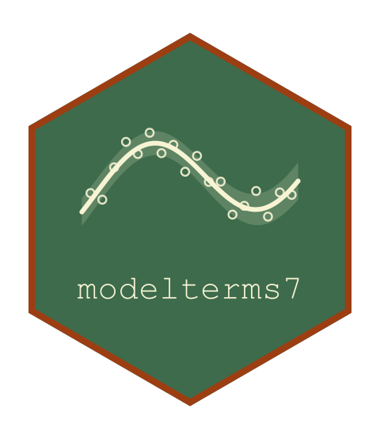

<!-- README.md is generated from README.Rmd. Please edit that file, then
     regenerate with devtools::build_readme(). Do not use knitr::knit(): it
     processes the code but leaves this YAML header in the output as literal
     text, which GitHub and pkgdown both render verbatim. -->

<!-- badges: start -->

[](https://github.com/statmodels7/modelterms7/actions/workflows/R-CMD-check.yaml)
[](https://app.codecov.io/gh/statmodels7/modelterms7)
[](https://lifecycle.r-lib.org/articles/stages.html#experimental)
<!-- badges: end -->

# modelterms7 

Model terms as S7 objects. A term is the recipe a formula names: the
mapping from a data frame to a design-matrix block, the penalty attached
to the block’s coefficients, and the metadata a fit reads – coefficient
names, hyperparameters with their links, whether the penalized objective
is differentiable, and how effective degrees of freedom are counted.

Part of the [statmodels7](https://statmodels7.github.io) toolkit.

## Installation

``` r
# install.packages("pak")
pak::pak("statmodels7/modelterms7")
```

## The terms

An **additive** term contributes a block of columns, so the predictor is
$\eta = \sum_t X_t \beta_t$ and a penalized fit minimizes
$-\ell(\beta) + \sum_t \rho_t(\beta_t; \theta_t)$:

- `linpar()` is the unpenalized parametric block;
- `ridge()`, `lasso()`, `scad()`, `mcp()` and `enet()` attach the
  corresponding [penalties7](https://statmodels7.github.io/penalties7/)
  object to their block;
- `random()` builds grouped intercepts and slopes with the effect
  distribution as the penalty, correlated or not through a
  [parameters7](https://statmodels7.github.io/parameters7/) structure
  replicated across groups;
- `s()` and `te()` are the penalized smooths of one and of several
  covariates, built on [basis7](https://statmodels7.github.io/basis7/);
- `nl()` carries a contribution nonlinear in its own parameters, its
  block the Jacobian refreshed as they move;
- `seg()`, `jump()` and `jseg()` estimate the break-points at which an
  effect changes slope, level, or both, with `seg_start()` choosing
  where the iteration begins.

A **structural** term rewrites the likelihood rather than adding to it:
`gas()` gives score-driven dynamics and `regime()` a latent Markov
chain, both returning their exact derivative alongside the state because
the recursion is the only place it can be computed. `cens()` marks a
censored response on the left side of the formula.

## A formula, interpreted

The interpreter recognizes a term by what its call evaluates to, not by
its name, so a term class defined outside the package works in a formula
without registration.

``` r
dd <- data.frame(y = rnorm(50), x1 = rnorm(50), x2 = rnorm(50),
                 g = factor(sample(letters[1:5], 50, TRUE)))
dd$L <- matrix(rnorm(50 * 3), 50, 3)

out <- interpret_formula(y ~ x1 + log(abs(x2)) + lasso(L) +
                           random(~ 1 | g), dd)
names(out$terms)
#> [1] "linpar"         "lasso(L)"       "random(~1 | g)"
```

`x1` and `log(abs(x2))` collapse into one `linpar`: a bare covariate is
a covariate, and so is a call whose value is not a term.

``` r
built <- lapply(out$terms, term_build, data = dd)
vapply(built, term_npar, integer(1))
#>         linpar       lasso(L) random(~1 | g) 
#>              3              3              5
vapply(built, term_smooth, logical(1))
#>         linpar       lasso(L) random(~1 | g) 
#>           TRUE          FALSE           TRUE
```

`term_smooth()` is read from the penalty rather than declared by the
term, so the lasso block reports `FALSE` and the model layer knows which
coefficients need a non-smooth method.

## What a built term carries

``` r
sm <- term_build(s(x1, k = 8), dd)
dim(term_matrix(sm))
#> [1] 50  7
term_coef_names(sm)
#> [1] "s(x1).lin" "s(x1).z1"  "s(x1).z2"  "s(x1).z3"  "s(x1).z4"  "s(x1).z5" 
#> [7] "s(x1).z6"
term_penalty(sm)@params
#> [1] "lambda"
```

Every built term also carries a blueprint that reproduces the mapping on
new data, reapplying the factor levels, contrasts and knot placement
recorded at build time rather than deriving them again.

``` r
newdd <- dd[1:5, ]
identical(term_predict(sm, newdd), term_matrix(sm)[1:5, ])
#> [1] TRUE
```

`check_term()` validates a term against a data frame – the block’s shape
and names, that prediction on the same data reproduces the block, and
that prediction on a subset equals the corresponding rows, which is the
check a term that rebuilds instead of reapplying fails.

``` r
res <- check_term(linpar(~ x1 + g), dd, verbose = FALSE)
all(res$status == "OK")
#> [1] TRUE
```

`edf()` computes effective degrees of freedom from the pieces a fit
supplies: exactly the column count for an unpenalized block,
$\operatorname{tr}[(H + S)^{-1} H]$ for a smooth penalty, and the number
of nonzero coefficients for the lasso, SCAD and MCP.
